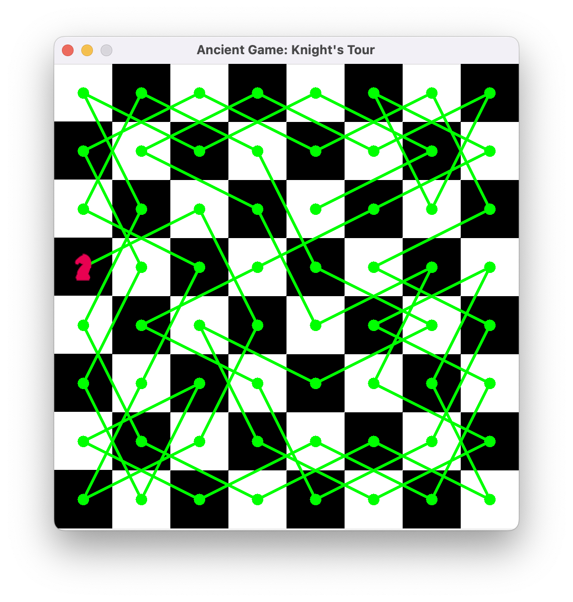

# Knight Tour Puzzle

This is a Java project that solves the Knight Tour Puzzle.

## Description

The Knight Tour Puzzle is a mathematical problem where the task is to find a sequence of moves for a knight on a chessboard such that the knight visits every square exactly once.

## Usage

To run the project, follow these steps:

1. Compile the Java source files: `javac *.java`
2. Run the program: `java Board`
